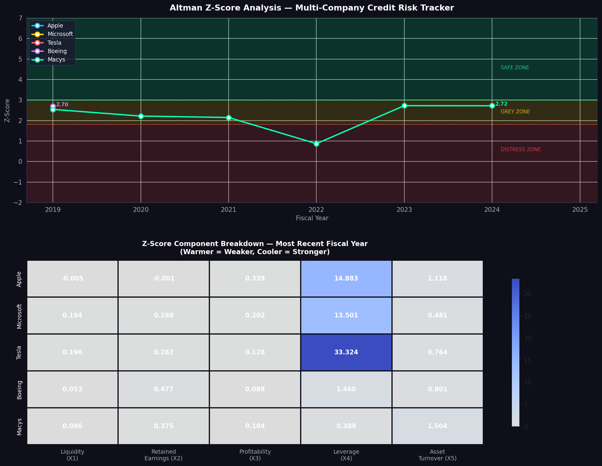
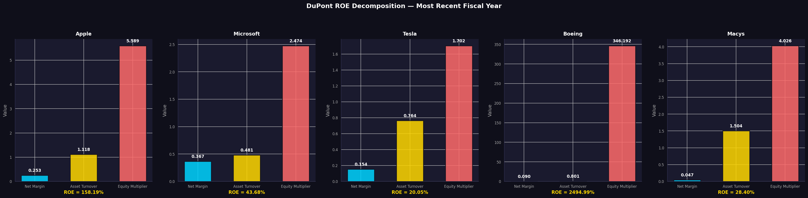

# Financial Statement Analyzer & Altman Z-Score Bankruptcy Predictor

## Project Overview

An automated financial statement analysis engine that pulls real company filings directly from the SEC EDGAR API, extracts key accounting data, and computes the Altman Z-Score bankruptcy prediction model and DuPont ROE decomposition across multiple companies. The output mirrors what a credit analyst or equity research associate would produce manually — but automated, reproducible, and scalable across any publicly listed US company.

## Real-World Use Case

Every credit decision — whether a bank lending to a company, a hedge fund taking a short position, or an auditor assessing going-concern risk — starts with financial statement analysis. The Altman Z-Score is one of the most widely cited quantitative tools for assessing corporate financial health, used by credit teams, distressed debt funds, audit firms, and equity research desks.

## What It Does

- Pulls live 10-K filing data directly from the SEC EDGAR XBRL API (no manual downloads)
- Computes all 5 Altman Z-Score components and classifies each company into Safe, Grey, or Distress zones
- Performs DuPont ROE decomposition to break down return on equity into margin, turnover, and leverage drivers
- Produces a professional credit analysis dashboard and summary report across a 5-company universe

## Key Findings

- **Apple** (Z-Score: 11.16, Safe) and **Microsoft** (Z-Score: 9.89, Safe) are deeply financially healthy, driven by strong market valuations relative to liabilities
- **Tesla** (Z-Score: 21.78, Safe) scores extremely high due to its large market cap relative to balance sheet liabilities
- **Boeing** (Z-Score: 2.70, Grey) and **Macys** (Z-Score: 2.72, Grey) sit in the Grey Zone, reflecting post-COVID stress and structural retail challenges respectively
- Boeing's equity multiplier of 346x reflects near-negative equity — a genuinely distressed balance sheet position worth monitoring

## DuPont Dashboard

## Technologies Used

- **Python** — pandas, numpy, matplotlib, seaborn, requests, yfinance
- **SEC EDGAR XBRL API** — live 10-K filing data, no API key required
- **Yahoo Finance** — market capitalisation data for Z-Score X4 component

## How to Run

1. Open `Financial_Statement_Analyzer.ipynb` in Google Colab
2. Run all cells sequentially from top to bottom
3. Data is pulled live from SEC EDGAR and Yahoo Finance — no manual downloads needed
4. Charts and summary report are saved automatically to the Colab environment

## Resume Description

*Built an automated financial statement analyzer in Python, pulling real SEC EDGAR filings via API to compute Altman Z-Scores, DuPont ROE decompositions, and key credit ratios across a multi-company universe; produced a professional credit analysis dashboard used to assess bankruptcy risk in line with methods used by credit teams and audit firms.*

## Potential Upgrades

- Add Beneish M-Score for earnings manipulation detection
- Add sector benchmarking to rank each company against industry peers
- Add a time-series early warning flag for companies with 2+ consecutive years of Z-Score decline
